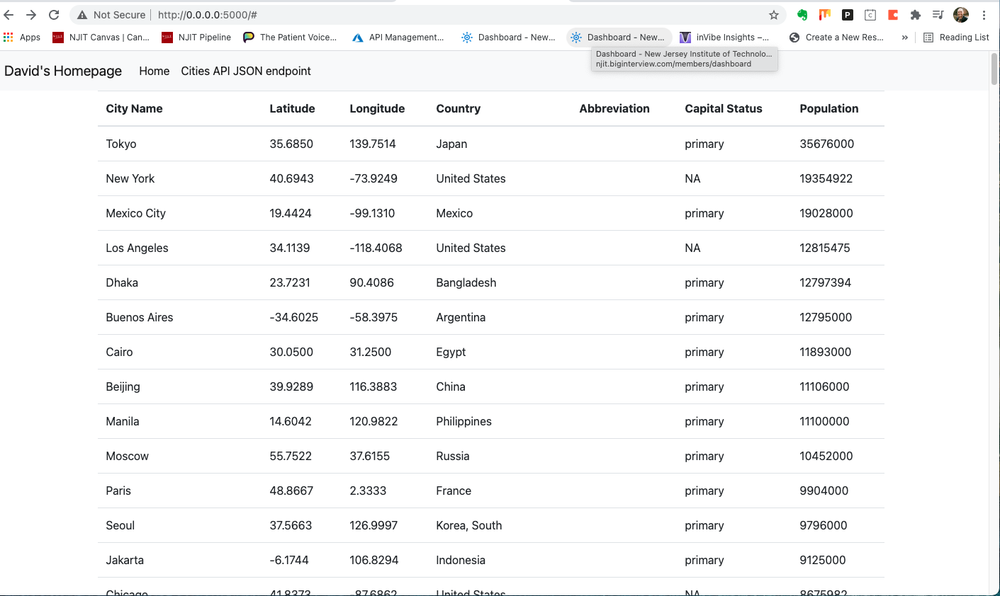
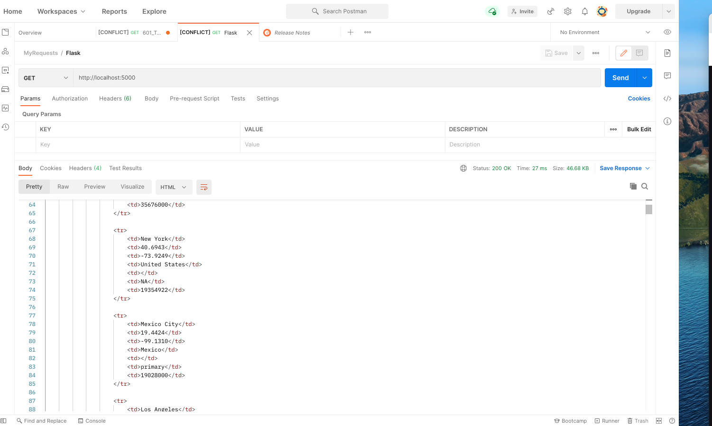

# NJIT 601 PythonDockerFlaskPycharm Project

This is a class project to learn how to set-up Docker, Flask, mySQL with Pycharm.

[Download Assignment Here... COMING SOON]()

[View Assignment Video here... COMING SOON]()

# Postman

# SQL Dta 

# localhost:5000 Index - Formatted

# # Postman with updated format

